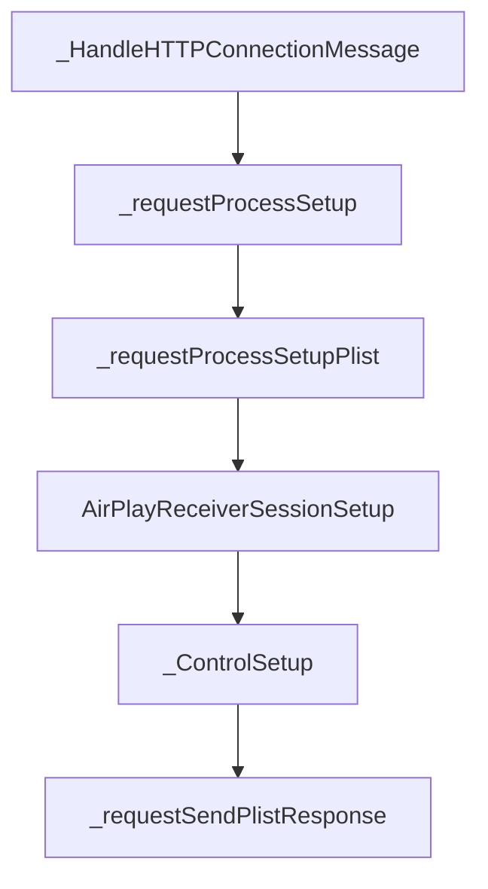

# AirPlay协议栈

## RTSP SETUP 信令

```txt
python parse_setup_pcap.py hostapd11_decrypted.pcap
共 6 条 SETUP

======== SETUP #1  CSeq=3  2026-08-04T02:40:09.519 ========
fe80:0:0:0:8ab:243a:38e5:a0d8:49769 -> fe80:0:0:0:2cab:f9ff:fe63:c276:7000
SETUP rtsp://fe80::2cab:f9ff:fe63:c276/3321699497385152218 RTSP/1.0
请求 plist:
{
  "name": "胃袋有点大的IPhone",
  "updateSessionRequest": false,
  "statsCollectionEnabled": true,
  "sessionUUID": "2E190C18-003C-4EDA-A001-2608A5A4BA88",
  "osName": "iPhone OS",
  "keepAliveLowPower": true,
  "features": [
    "uiContext",
    "viewAreas",
    "cornerMasks",
    "focusTransfer",
    "h.264Level5.1",
    "mainBuffered",
    "altScreen",
    "enhancedSiri",
    "hevc",
    "vehicleStateProtocol",
    "sessionManagement",
    "videoPlayback",
    "logTransfer",
    "iAPChannel"
  ],
  "osBuildVersion": "23F84",
  "timingPort": 50744,
  "sourceVersion": "950.7.1",
  "osVersion": "26.5.2",
  "sessionCorrelationUUID": "D7F75517-3F90-4D59-89CA-541E7CD3C9EF",
  "internalBuild": false,
  "deviceID": "fc:9c:a7:26:26:a4",
  "diagnosticsAndUsage": true,
  "model": "iPhone15,4",
  "macAddress": "76:0B:66:52:2F:42"
}
Reply 2026-08-04T02:40:09.587: RTSP/1.0 200 OK
响应 plist:
{
  "keepAlivePort": 52416,
  "eventPort": 55087,
  "timingPort": 52257,
  "enabledFeatures": [
    "altScreen",
    "enhancedSiri",
    "uiContext",
    "viewAreas",
    "cornerMasks",
    "hevc",
    "h.264Level5.1",
    "mainBuffered",
    "sessionManagement",
    "logTransfer",
    "iAPChannel"
  ]
}
```

这里编写脚本来解析 `SETUP`信令的 `plist` 协商具体的信息。这里暂时不关注其他信息，仅仅关注 `request` 和 `response` 的 `socket` 的相关的信息。可以看到手机给过来 ` timingPort` 是 `50744`。 而车机回复了三个 `tcp` 或者 `udp` 的端口信息，即  `keepAlivePort - 52416` ，`eventPort - 55087`，`timingPort - 52257`

### AirPlay 协议栈 如何处理 `SETUP` 信令

`SETUP` 信令处理流程如下：



```c
static OSStatus _HandleHTTPConnectionMessage(HTTPConnectionRef inCnx, HTTPMessageRef inRequest, void *inContext)
{
    ....
    
    //这里可以看到，明显AirPlay协议栈要求所有RTSP处理都是需要在Pair-verify和Auth-setup之后。
    if (!cnx->pairingVerified && ((strnicmpx(methodPtr, methodLen, "POST") != 0) || ((strnicmp_suffix(pathPtr, pathLen, "/pair-setup") != 0) && (strnicmp_suffix(pathPtr, pathLen, "/pair-verify") != 0) && (strnicmp_suffix(pathPtr, pathLen, "/auth-setup") != 0))))
    {
        aprs_ulog(kLogLevelNotice, "### Unverified RTSP request denied: %.*s %.*s\n",
                  (int)methodLen, methodPtr, (int)pathLen, pathPtr);
        _requestReportIfIncompatibleSender(cnx, inRequest);
        //返回未授权
        status = kHTTPStatus_Unauthorized;
        goto SendResponse;
    }
    
    if (strnicmpx(methodPtr, methodLen, "OPTIONS") == 0)
        status = _requestProcessOptions(cnx);
    else if (strnicmpx(methodPtr, methodLen, "FLUSH") == 0)
        status = _requestProcessFlush(cnx, inRequest);
    else if (strnicmpx(methodPtr, methodLen, "RECORD") == 0)
        status = _requestProcessRecord(cnx, inRequest);
    else if (strnicmpx(methodPtr, methodLen, "SETUP") == 0)
        
      	//处理 Rtsp Setup
        status = _requestProcessSetup(cnx, inRequest);
    
    ...
}
```


`_HandleHTTPConnectionMessage` 这个函数即处理所有的 `RTSP`信令的入口。这里去比对 `method` 的名称，如果方法名称是 `SETUP` ，那么就得就将这次请求交给的 `_requestProcessSetup` 去处理。

```c
static HTTPStatus _requestProcessSetup(AirPlayReceiverConnectionRef inCnx, HTTPMessageRef inRequest)
{
    ···
    if (MIMETypeIsPlist(ptr, len))
    {
        
        status = _requestProcessSetupPlist(inCnx, inRequest);
        goto exit;
    }
    ···
}
```

`_requestProcessSetup`  函数比较简单，直接判断传递过来的参数  `MIME` 类型是否是 `Plist` 类型， 是直接调用 `_requestProcessSetupPlist` 继续处理携带的参数。


```c
static HTTPStatus _requestProcessSetupPlist(AirPlayReceiverConnectionRef inCnx, HTTPMessageRef inRequest)
{
    ....

    u64 = CFDictionaryGetMACAddress(requestParams, CFSTR(kAirPlayKey_DeviceID), NULL, &err);
    if (!err)
        inCnx->clientDeviceID = u64;

    strlcpy(inCnx->ifName, inCnx->httpCnx->ifName, sizeof(inCnx->ifName));

    CFDictionaryGetMACAddress(requestParams, CFSTR(kAirPlayKey_MACAddress), inCnx->clientInterfaceMACAddress, &err);

    CFDictionaryGetCString(requestParams, CFSTR(kAirPlayKey_Name), inCnx->clientName, sizeof(inCnx->clientName), NULL);

    CFDictionaryGetData(requestParams, CFSTR(kAirPlayKey_SessionUUID), sessionUUID, sizeof(sessionUUID), &len, &err);
    
    ....
        
    if (features)
    {
        //解析features
    }
    
  	....
    
    //创建 session
	err = _requestCreateSession(inCnx, true, sessionCorrelationUUID);
    
    //建立 AirPlayReceiverSession 
    err = AirPlayReceiverSessionSetup(inCnx->session, requestParams, &responseParams);
    
    //
    status = _requestSendPlistResponse(inCnx->httpCnx, inRequest, responseParams, &err);
    
    ....
}
```

`_requestProcessSetupPlist` 中会对携带 `Plist` 进行解析，之后调用 `_requestCreateSession` 创建 `session`，建立 `AirPlaySession`，最终将`AirPlaySession` 的一些信息返回走 `RTSP` 返回给手机。

下面详细了解下：`AirPlayReceiverSessionSetup` 做了些，上面 `keepAlivePort` ，`eventPort`，`timingPort` 这些 `socket` 如何创建


```c
AirPlayReceiverSessionSetup(
    AirPlayReceiverSessionRef me,
    CFDictionaryRef           inRequestParams,
    CFDictionaryRef          *outResponseParams)
{    
    ....
    
    if (!me->controlSetup)
    {
        err = _ControlSetup(me, inRequestParams, responseParams);
        require_noerr(err, exit);
		....
    }

    
}
```

`AirPlayReceiverSessionSetup` 涉及到 `socket` 这些控制端口逻辑被封装在 `_ControlSetup`，剩下逻辑涉及到具体  `stream` 的创建，这个在后续`stream`创建章节进行具体分析。


```c
static OSStatus
_ControlSetup(
    AirPlayReceiverSessionRef inSession,
    CFDictionaryRef           inRequestParams,
    CFMutableDictionaryRef    inResponseParams)
{
    ....
    //创建时间同步socket.
    err = _TimingInitialize(inSession);
    require_noerr(err, exit_unlock_teardown);
    CFDictionarySetInt64(inResponseParams, CFSTR(kAirPlayKey_Port_Timing), inSession->timingPortLocal);

    if (CFDictionaryGetBoolean(inRequestParams, CFSTR(kAirPlayKey_KeepAliveLowPower), NULL))
    {
        // Supports receiving UDP beacon as keep alive.
		
        //创建保活keepAlive的socket
        err = _IdleStateKeepAliveInitialize(inSession);
        require_noerr(err, exit_unlock_teardown);
        CFDictionarySetInt64(inResponseParams, CFSTR(kAirPlayKey_Port_KeepAlive), inSession->keepAlivePortLocal);
    }

    if (inSession->useEvents)
    {
        //创建了eventSocket的tcp socket,
        err = ServerSocketOpenEx3(SOCK_STREAM, IPPROTO_TCP,
                                  inSession->server->ifname, -kAirPlayPort_RTSPEvents,
                                  &inSession->eventPort, kSocketBufferSize_DontSet,
                                  CUServerSocketFlagsNone, &inSession->eventSock);
        require_noerr(err, exit_unlock_teardown);

        CFDictionarySetInt64(inResponseParams, CFSTR(kAirPlayKey_Port_Event), inSession->eventPort);

        atr_ulog(kLogLevelTrace, "Events set up on port %d\n", inSession->eventPort);
    }
    ....
}
```

```c
static OSStatus _TimingInitialize(AirPlayReceiverSessionRef inSession)
{
    OSStatus    err;
    sockaddr_ip sip;

    // Set up a socket to send and receive timing-related info.

    SockAddrCopy(&inSession->peerAddr, &sip);
    //这里创建了UDP的socket， 这个socket端口会给 timingSock 去使用
    err = ServerSocketOpenEx3(SOCK_DGRAM, IPPROTO_UDP,
                              inSession->server->ifname, -kAirPlayPort_TimeSyncClient,
                              &inSession->timingPortLocal, kSocketBufferSize_DontSet,
                              CUServerSocketFlagsNone, &inSession->timingSock);
}
```

```c
static OSStatus _IdleStateKeepAliveInitialize(AirPlayReceiverSessionRef inSession)
{
    OSStatus err;

    check(!IsValidSocket(inSession->keepAliveSock));

    // Set up a socket to receive udp keep alive beacon.
    
    //这里创建了UDP的socket， 这个socket端口会给 keepAliveSock 去使用
    err = ServerSocketOpenEx3(SOCK_DGRAM, IPPROTO_UDP,
                              inSession->server->ifname, -kAirPlayPort_KeepAlive,
                              &inSession->keepAlivePortLocal, kSocketBufferSize_DontSet,
                              CUServerSocketFlagsNone, &inSession->keepAliveSock);
}
```


从上面函数调用的角度来看，`_ControlSetup` 创建了对应端口的 `socket`， 均是使用 `ServerSocketOpenEx3` 创建。其中 `keepAlivePort` `timingPort` 是 `udp`   套接字，`eventPort` 是 `tcp` 套接字。


> 这里需要注意一点，`eventPort` 在这个阶段仅仅是创建一个**被动套接字**，只有在`RECORD`信令之后经过 `accept` 之后变成主动套接字之后才能发送信令给到手机。

