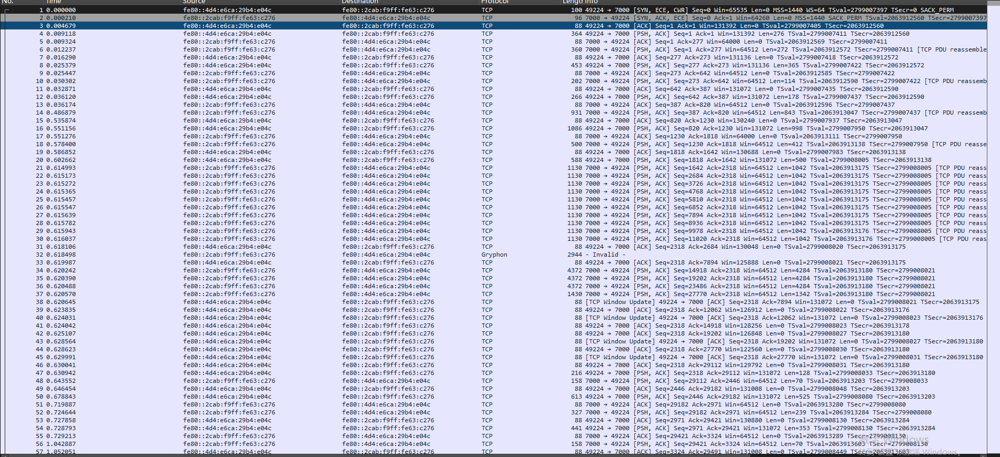
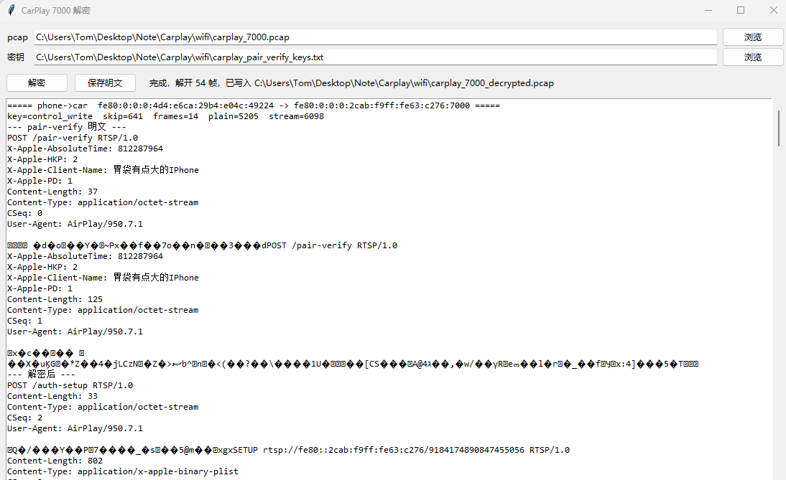
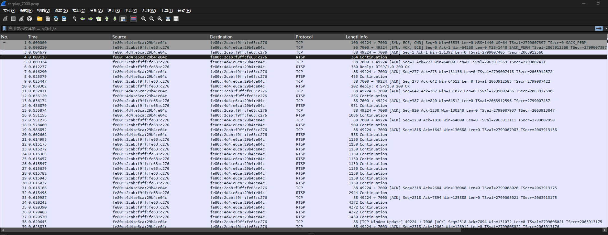
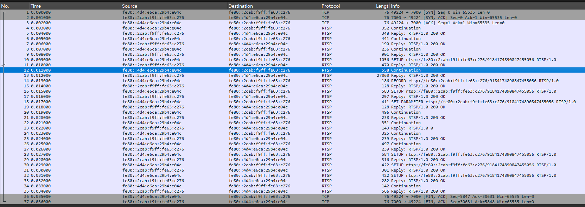
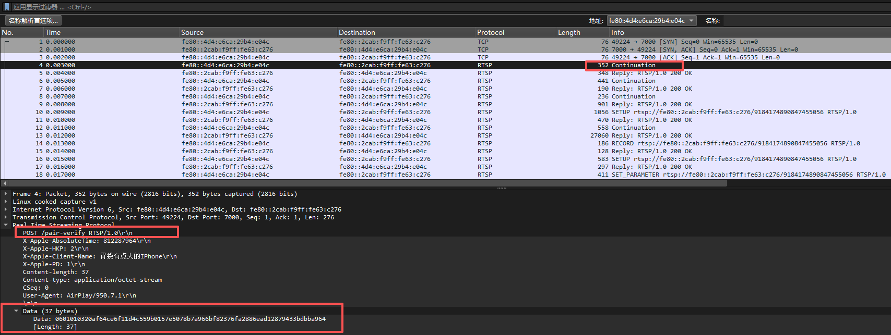
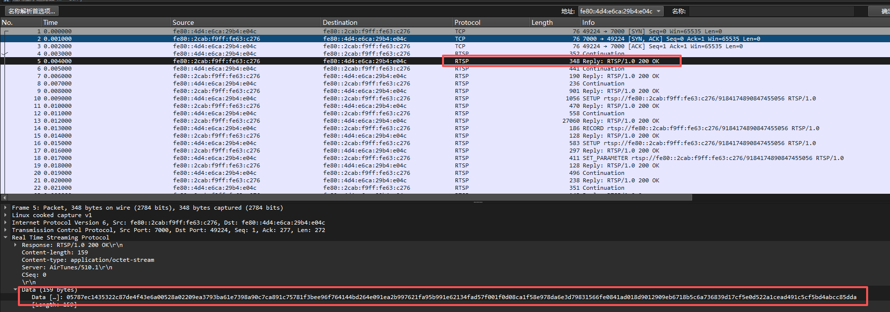
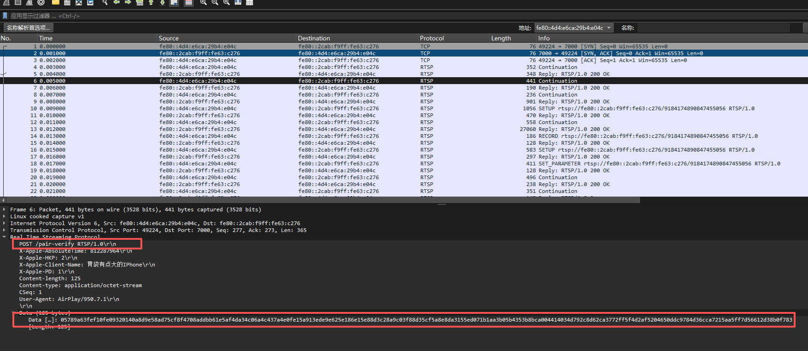
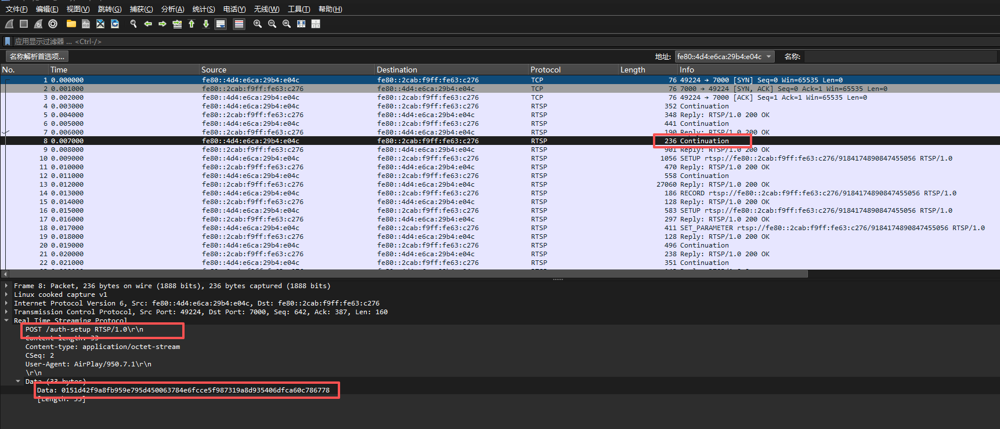
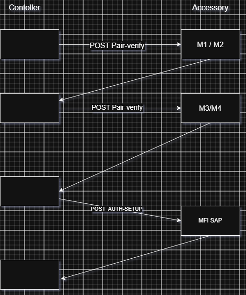

# 无线CarPlay Wifi 连接流程详解

 从无线 `CarPlay` 连接整个流程角度来说，相对于前半部分的蓝牙传输部分，`iap2 on bluetooth` 这个部分涉及到传输等等都是明文的方式，可以直接抓取蓝牙的hci日志可以清楚的知道无线 `CarPlay` 传输了什么报文以及交互流程，但是一旦过渡到 `wifi` 部分，这个部分我们可以抓取无线 `wifi` 信号或者也可以抓取经过网卡驱动后的以太网报文。

这里以抓取热点网卡的`pcap`为起点，后续的分析都将基于热点驱动处理后以太网帧报文,

下面就是抓取 `7000` 端口的所有报文：




使用 `WireShark` 看到，这边仅仅是`TCP` 裸流，我们没法知道手机在 `wifi` 上和车机是怎么交互的，所以我们需要处理。下面说明下处理过程，`Wifi` 过程的 `Iap2`和蓝牙不一样，无论是控制还是普通的音视频数据都会加密。所以我们需要先进行解密，而解密均是需要密钥的，这样就可以得出第一步就是保存私钥。

## Pcap文件 预处理


### 私钥保存

```c
#if (TARGET_OS_ANDROID)
#include <errno.h>
#include <fcntl.h>
#include <sys/stat.h>
#include <sys/system_properties.h>
#include <unistd.h>
#ifndef PROP_VALUE_MAX
#define PROP_VALUE_MAX 92
#endif
#define kPairVerifyKeyDumpProperty "debug.carplay.save_pair_keys"
#define kPairVerifyKeyDumpPath     "/data/local/tmp/carplay_pair_verify_keys.txt"
#endif

#if (TARGET_OS_ANDROID)
static Boolean _PairVerifyKeyDumpEnabled(void)
{
    char value[PROP_VALUE_MAX];
    int  n;

    n = __system_property_get(kPairVerifyKeyDumpProperty, value);
    if (n <= 0)
        return (false);
    return ((stricmp(value, "true") == 0) || (strcmp(value, "1") == 0));
}

static void _AppendKeyLine(char *buf, size_t cap, size_t *used, const char *name, const uint8_t key[32])
{
    char hex[65];
    int  n;

    if (*used >= cap)
        return;
    DataToHexCString(key, 32, hex);
    n = snprintf(&buf[*used], cap - *used, "%s=%s\n", name, hex);
    MemZeroSecure(hex, sizeof(hex));
    if ((n > 0) && ((size_t)n < (cap - *used)))
        *used += (size_t)n;
}

static void _SavePairVerifyKeysIfEnabled(PairingSessionRef session, const uint8_t controlRead[32], const uint8_t controlWrite[32])
{
    uint8_t  eventsRead[32];
    uint8_t  eventsWrite[32];
    char     buf[768];
    size_t   used = 0;
    int      fd;
    int      n;
    OSStatus deriveErr;

    if (!_PairVerifyKeyDumpEnabled())
        return;

    MemZeroSecure(eventsRead, sizeof(eventsRead));
    MemZeroSecure(eventsWrite, sizeof(eventsWrite));
    deriveErr = PairingSessionDeriveKey(session, kAirPlayPairingEventsKeySaltPtr, kAirPlayPairingEventsKeySaltLen,
                                        kAirPlayPairingEventsKeyReadInfoPtr, kAirPlayPairingEventsKeyReadInfoLen,
                                        sizeof(eventsRead), eventsRead);
    if (!deriveErr)
    {
        deriveErr = PairingSessionDeriveKey(session, kAirPlayPairingEventsKeySaltPtr, kAirPlayPairingEventsKeySaltLen,
                                            kAirPlayPairingEventsKeyWriteInfoPtr, kAirPlayPairingEventsKeyWriteInfoLen,
                                            sizeof(eventsWrite), eventsWrite);
    }

    n = snprintf(buf, sizeof(buf),
                 "# phone->car control: control_write\n"
                 "# car->phone control: control_read\n"
                 "# phone->car events: events_read\n"
                 "# car->phone events: events_write\n");
    if (n > 0)
        used = (size_t)n;

    _AppendKeyLine(buf, sizeof(buf), &used, "control_write", controlWrite);
    _AppendKeyLine(buf, sizeof(buf), &used, "control_read", controlRead);
    if (!deriveErr)
    {
        _AppendKeyLine(buf, sizeof(buf), &used, "events_read", eventsRead);
        _AppendKeyLine(buf, sizeof(buf), &used, "events_write", eventsWrite);
    }

    fd = open(kPairVerifyKeyDumpPath, O_CREAT | O_TRUNC | O_WRONLY, 0644);
    if (fd < 0)
    {
        aprs_ulog(kLogLevelWarning, "### pair-verify key dump open failed errno=%d\n", errno);
    }
    else
    {
        if (write(fd, buf, used) != (ssize_t)used)
            aprs_ulog(kLogLevelWarning, "### pair-verify key dump write failed errno=%d\n", errno);
        else
            aprs_ulog(kLogLevelNotice, "pair-verify keys saved to %s\n", kPairVerifyKeyDumpPath);
        (void)fchmod(fd, 0644);
        close(fd);
    }

    MemZeroSecure(buf, sizeof(buf));
    MemZeroSecure(eventsRead, sizeof(eventsRead));
    MemZeroSecure(eventsWrite, sizeof(eventsWrite));
}
#endif

```


之后在 `_HandlePairVerifyHomeKitCompletion(HTTPMessageRef inMsg)`实现中调用 `_SavePairVerifyKeysIfEnabled` 方法即可。这样编译出 `so` 并且设置

`setprop debug.carplay.save_pair_keys true` 连接无线CarPlay之后就会将私钥保存为：`/data/local/tmp/carplay_pair_verify_keys.txt`

```txt
# phone->car control: control_write
# car->phone control: control_read
# phone->car events: events_read
# car->phone events: events_write
control_write=807cf03cbff0c8660744b57505557eec564c705090a13e8cf4572cdf3b11790e
control_read=a9cc303a7d1f256f1dad918d42de95b87cbc7ffa7fca2b44228ff94923ce4f2e
events_read=a3be69dd1c818cb2df2a498d14640177e690d7ab4e0983488ed22419d35b9d5f
events_write=017760abe6ff5f251ce15c73f663ef1752918cfbb04f0aa660599edb375db619
```

这里针对于这次连接的私钥信息，保存到 `txt` 中。


### Python 解密 pcap

这里定义了编写了 `Python` 代码来做了 `pcap` 的解密。详细代码在：[解码Python](decrypt_carplay.py)

运行解码 `python` 代码之后并且选择 `pcap` 以及私钥文件后



解密完成，解密完成之后的 `pcap` 被写入到 `carplay_7000_decrypted.pcap` 中。后续对于无线 `CarPlay Wifi` 阶段都将基于解密之后的 `pcap` 来分析。至此，准备工作完成。



上述是解密之前



上述是解密之后，对比可以看到，我们可以看到更多`RTSP`的协议语义、包括具体的 `SETUP`、`RECORD` 协议等等。

### 疑惑备注

这里其实在解析时存在一些疑惑。

1. 为什么这里 `RTSP` 还是会存在 `Continuation` ，这个实际上是 `WireShark` 的解析器行为，默认上，`WireShark`解析时只支持 `RTSP` 的蓝皮书协议字段，但 `AirPlay` 是对 `RTSP` 协议栈做了一些扩展。

   

> ```c
> static HTTPStatus _requestProcessOptions(AirPlayReceiverConnectionRef inCnx)
> {
>     HTTPMessageRef response = inCnx->httpCnx->responseMsg;
>     HTTPHeader_SetField(&response->header, kHTTPHeader_Public, "ANNOUNCE, SETUP, RECORD, PAUSE, FLUSH, TEARDOWN, OPTIONS, POST, GET, PUT, GET_PARAMETER");
>     return (kHTTPStatus_OK);
> }
> ```

这里可以清楚的看到， 这里的 `POST` / `GET` / `PUT` 都是 `RTSP` 的扩展，而非官方协议支持的，所以 `WireShark` 解析为 `Continuation` 属于正常行为。


2. 为什么在 `AirPlay` 协议栈中，使用的是 `HTTP` 报文格式进行解析的。`CarPlay` 控制到底是基于 `HTTP` 还是`RTSP` ？

上述 `Pcap`中可以解答这一点，`CarPlay`  会话控制均是基于 **RTSP 协议** 来实现，至于和` HTTP` 协议有一点相似，是因为`RTSP` 从诞生起就是按照 `HTTP/1.1` 的格式定的，所以`HTTP` 的报文解析器可以完全解析 `RTSP` 的报文。而且第一点中，实现的`POST` / `PUT` / `GET` 很容易和 `HTTP` 协议混在一起。但是实际上，`CarPlay` 控制完全就是基于 `RTSP`。


## 无线CarPlay Wifi阶段连接流程

`Wifi`连接流程中：整体流程为：`tcp` 三次握手 -> `HttpServer` 接收 `pair-verify` -> `HttpServer` 第二次的接收到 `pair-verify` -> `HttpServer` 接收到 `auth-setup`

-> `HttpServer` 接收到 `GET /info` -> 之后在 `HttpServer` 会接收到很多从 `Controller`  发过来 `POST`请求。 

`carplay_7000_decrypted.pcap` 可详细的展示这块细节


这里可以给出`CarPlay Wifi`阶段连接流程。

- `POST /pair-verify RTSP/1.0`
- `POST /pair-verify RTSP/1.0`
- `POST /auth-setup RTSP/1.0`
- `GET /info RTSP/1.0`
- `POST /command RTSP/1.0`
- 其他标准 `RTSP` 协议

可以看到 `AirPlay` 协议栈在 `Wifi` 阶段接收到两次自定义` RTSP POST`信令，并且传递的值均为  `pair-verify`。这两次 `POST` 很重要。 他是CarPlay安全传输数据的基础的。接收到 `pair-verify` ，`AirPlay` 协议栈 又接收到 `auth-setup`，这一次 `POST` 同样很重要，它可以确保，连接的对端是一个可用 CarPlay设备。

## Pair-verify1

`HttpServer` 会接收到两次 `Pair-verify` 请求，为了区分这两次 `Pair-verify` 的 `POST` 请求，所以这里将第一次的 `Pair-verify` 称为 `Pair-verify1`。从整个通信的过程来看，`Pair-verify` 的过程主要为后面链路做铺垫。此过程即会去和手机协商公钥以及后续传输的签名，后续手机和  `HttpServer` 的传输数据均为加密的。



从 `pcap` 中可以看到明显的交互流程，如果需要了解这次传输什么数据就需要去从代码的角度去分析下：

```c
status = _requestProcessPairVerify(cnx, inRequest);
        		|           
				| - - - - -> PairingSessionCreate() 这个类型为（kPairingSessionType_VerifyServer） / PairingSessionExchange()
                | - - - - -> _VerifyPairingServerExchange() 
```

`_VerifyPairingServerExchange` 中涉及到很多密码学的知识，`Verify` 这个过程使用状态机来维护这个过程。

### M1 状态

```c
if( me->state == kPairingStateInvalid ) me->state = kPairVerifyStateM1; //初始状态机为 m1

err = RandomBytes( me->ourCurveSK, sizeof( me->ourCurveSK ) );

require_noerr( err, exit );

HKDF_SHA512( me->ourCurveSK, sizeof( me->ourCurveSK ), 
    kPairVerifyECDHSaltPtr, kPairVerifyECDHSaltLen, 
    kPairVerifyECDHInfoPtr, kPairVerifyECDHInfoLen, 
    sizeof( me->ourCurveSK ), me->ourCurveSK );
//生成了车机端的私钥，并且将私钥设置保存在 ourCurveSK中。

curve25519( me->ourCurvePK, me->ourCurveSK, NULL );
//上述的过程通过私钥派生成了车机端的公钥，并且将公钥设置保存在 ourCurvePK中，后续会将公钥设置给Contoller。

//这一步骤完成之后，车机的私钥和公钥都已经创建完成。

err = TLV8GetBytes( inputPtr, inputEnd, kTLVType_PublicKey, 32, 32, me->peerCurvePK, NULL, NULL );
//从POST 中拿到携带的手机端的公钥。
require_noerr( err, exit );

curve25519( me->sharedSecret, me->ourCurveSK, me->peerCurvePK );
//车机的私钥和手机的公钥生成了共享密码。后续数据传输会使用这个共享密码来加密数据。
```

所以上面图中 `Pair-verify` 携带参数是手机侧携带的公钥。

至此，`Verify M1` 状态结束，之后进入到 `M2` 状态。总结下来，`M1` 状态主要是接收手机传递过来公钥的，后续使用 `curve25519` 算法来生成公钥、私钥、以及共享密钥。

### M2 状态

M1状态中生成了共享密钥，加密解密都是均使用共享密钥去完成。但是到这一步仅仅共享密钥是不够安全的，会受到中间人攻击。所以会存在M2状态。M2状态中引入了签名，以便来进一步加强安全性来确保通信就是对方。

```c
// M2: Accessory -> Controller -- Start Response.

// Generate signature of our info.

ForgetPtrLen( &me->activeIdentifierPtr, &me->activeIdentifierLen );

//通过私钥和公钥生成签名标识。
err = PairingSessionCopyIdentity( me, false, &me->activeIdentifierPtr, me->ourEdPK, me->ourEdSK );
require_noerr_quiet( err, exit );
me->activeIdentifierLen = strlen( me->activeIdentifierPtr );
require_action( me->activeIdentifierLen > 0, exit, err = kIDErr );

len = 32 + me->activeIdentifierLen + 32;
storage = (uint8_t *) malloc( len );
require_action( storage, exit, err = kNoMemoryErr );
memcpy( &storage[  0 ], me->ourCurvePK, 32 );
memcpy( &storage[ 32 ], me->activeIdentifierPtr, me->activeIdentifierLen );
memcpy( &storage[ 32 + me->activeIdentifierLen ], me->peerCurvePK, 32 );

//使用Ed25519来生成签名。
Ed25519_sign( sig, storage, len, me->ourEdPK, me->ourEdSK );
ForgetMem( &storage );

// Build sub-TLV of accessory's info and encrypt it.

err = TLV8BufferAppend( &etlv, kTLVType_Identifier, me->activeIdentifierPtr, me->activeIdentifierLen );
require_noerr( err, exit );
err = TLV8BufferAppend( &etlv, kTLVType_Signature, sig, 64 );
require_noerr( err, exit );

storage = (uint8_t *) malloc( etlv.len + 16 );
require_action( storage, exit, err = kNoMemoryErr );
HKDF_SHA512( me->sharedSecret, sizeof( me->sharedSecret ), 
    kPairVerifyEncryptSaltPtr, kPairVerifyEncryptSaltLen, 
    kPairVerifyEncryptInfoPtr, kPairVerifyEncryptInfoLen, 
    sizeof( me->key ), me->key );

//sharedSecret使用共享密钥来加密签名。
chacha20_poly1305_encrypt_all_64x64( me->key, (const uint8_t *) "PV-Msg02", NULL, 0, 
    etlv.ptr, etlv.len, storage, &storage[ etlv.len ] );
err = TLV8BufferAppend( &tlv, kTLVType_EncryptedData, storage, etlv.len + 16 );
require_noerr( err, exit );
ForgetMem( &storage );

me->state = kPairVerifyStateM2;

err = TLV8BufferAppend( &tlv, kTLVType_State, &me->state, sizeof( me->state ) );
require_noerr( err, exit );
err = TLV8BufferAppend( &tlv, kTLVType_PublicKey, me->ourCurvePK, 32 );
require_noerr( err, exit );
err = TLV8BufferDetach( &tlv, outOutputPtr, outOutputLen );
require_noerr( err, exit );

//最终将签名加上车机上公钥一起通过Http返回给到手机。
pair_ulog( me, kLogLevelTrace, "Pair-verify server M2 -- start response\n%?{end}%1{tlv8}\n", 
    !log_category_enabled( me->ucat, kLogLevelVerbose ), kTLVDescriptors, *outOutputPtr, *outOutputLen );
me->state = kPairVerifyStateM3;
break;
```

至此，连接的 `Pair-verify1` 阶段结束，从整个过程来看，主要是`M1`阶段是接收到手机传递过来的公钥、生成自己公钥，以及自己生成共享密钥。这些准备工作完成之后，进入到 `M2` 阶段，这个阶段会使用 `Ed25519` 算法来会生成设备的签名，后使用 `chacha20_poly1305_encrypt_all_64x64` 算法来对签名来加密 ，最终使用加密后的签名回复给手机。



上述传递 `159 `字节就是经过公钥、签名数据。

## Pair-verify 2



`vefify 2 RTSP Post`请求即对应着后续两个状态，即`M3、M4`。`M3`主要是处理从手机过来签名数据，确定是否是通信目标是合法的的以及共享密钥是否正确等等。

### M3 状态

```c
case kPairVerifyStateM3:
    pair_ulog( me, kLogLevelTrace, "Pair-verify server M3 -- finish request\n%?{end}%1{tlv8}\n", 
        !log_category_enabled( me->ucat, kLogLevelVerbose ), kTLVDescriptors, inInputPtr, (int) inInputLen );

    // Verify and decrypt sub-TLV.

	//这里从HttpBody中拿到加密之后的二进制数据。
    eptr = TLV8CopyCoalesced( inputPtr, inputEnd, kTLVType_EncryptedData, &elen, NULL, &err );
    require_noerr( err, exit );
    require_action( elen > 16, exit, err = kSizeErr );
    elen -= 16;
    eend = eptr + elen;

	//使用共享密钥进行解密
    err = chacha20_poly1305_decrypt_all_64x64( me->key, (const uint8_t *) "PV-Msg03", NULL, 0, eptr, elen, eptr, eend );
    if( err )
    {
        pair_ulog( me, kLogLevelWarning, "### Pair-verify server bad auth tag\n" );

        err = TLV8BufferAppendUInt64( &tlv, kTLVType_Error, kTLVError_Authentication );
        require_noerr( err, exit );
        err = TLV8BufferAppendUInt64( &tlv, kTLVType_State, kPairVerifyStateM4 );
        require_noerr( err, exit );
        err = TLV8BufferDetach( &tlv, outOutputPtr, outOutputLen );
        require_noerr( err, exit );

        _PairingSessionReset( me );
        goto exit;
    }

	//拿到手机端给过来的签名问题
    // Look up accessory's LTPK.

    ForgetPtrLen( &me->peerIdentifierPtr, &me->peerIdentifierLen );
    me->peerIdentifierPtr = (char*)TLV8CopyCoalesced( eptr, eend, kTLVType_Identifier, &me->peerIdentifierLen, NULL, &err );
    require_noerr( err, exit );
    require_action( me->peerIdentifierLen > 0, exit, err = kSizeErr );

    err = PairingSessionFindPeer( me, me->peerIdentifierPtr, me->peerIdentifierLen, me->peerEdPK );
    if( err )
    {
        pair_ulog( me, kLogLevelWarning, "### Pair-verify server unknown peer: %.*s\n", 
            (int) me->peerIdentifierLen, me->peerIdentifierPtr );

        err = TLV8BufferAppendUInt64( &tlv, kTLVType_Error, kTLVError_Authentication );
        require_noerr( err, exit );
        err = TLV8BufferAppendUInt64( &tlv, kTLVType_State, kPairVerifyStateM4 );
        require_noerr( err, exit );
        err = TLV8BufferDetach( &tlv, outOutputPtr, outOutputLen );
        require_noerr( err, exit );

        _PairingSessionReset( me );
        goto exit;
    }
    ForgetMem( &storage );

    // Verify signature of controller's info.
	//验证相对的签名。

    err = TLV8GetBytes( eptr, eend, kTLVType_Signature, 64, 64, sig, NULL, NULL );
    require_noerr( err, exit );

    len = 32 + me->peerIdentifierLen + 32;
    storage = (uint8_t *) malloc( len );
    require_action( storage, exit, err = kNoMemoryErr );
    memcpy( &storage[  0 ], me->peerCurvePK, 32 );
    memcpy( &storage[ 32 ], me->peerIdentifierPtr, me->peerIdentifierLen );
    memcpy( &storage[ 32 + me->peerIdentifierLen ], me->ourCurvePK, 32 );
    err = Ed25519_verify( storage, len, sig, me->peerEdPK );
    if( err )
    {
        pair_ulog( me, kLogLevelWarning, "### Pair-verify server bad signature: %#m\n", err );

        err = TLV8BufferAppendUInt64( &tlv, kTLVType_Error, kTLVError_Authentication );
        require_noerr( err, exit );
        err = TLV8BufferAppendUInt64( &tlv, kTLVType_State, kPairVerifyStateM4 );
        require_noerr( err, exit );
        err = TLV8BufferDetach( &tlv, outOutputPtr, outOutputLen );
        require_noerr( err, exit );

        _PairingSessionReset( me );
        goto exit;
    }
    ForgetMem( &storage );

    me->state = kPairVerifyStateM4;
```

从源码中可以清晰的看到，`M3 `这个过程主要时对手机端进行签名认证。之后状态机流转到 `M4`。

### M4 状态

```c
// M4: Accessory -> Controller -- Finish Response.

//将state作为 pair-verify 2的返回值。
err = TLV8BufferAppend( &tlv, kTLVType_State, &me->state, sizeof( me->state ) );
require_noerr( err, exit );
err = TLV8BufferDetach( &tlv, outOutputPtr, outOutputLen );
require_noerr( err, exit );

pair_ulog( me, kLogLevelTrace, "Pair-verify server M4 -- finish response\n%?{end}%1{tlv8}\n", 
    !log_category_enabled( me->ucat, kLogLevelVerbose ), kTLVDescriptors, *outOutputPtr, *outOutputLen );
me->state = kPairVerifyStateDone;
done = true;
pair_ulog( me, kLogLevelTrace, "Pair-verify server done\n" );
break;
```

## Pair-verify 流程总结

`Pair-verify` 总共会经历四个状态，状态流转为` M1 -> M2 -> M3 -> M4`， 其中 `M1 和 M2` 是 `Pair-verify1` 中状态。其中 M1 是接收手机公钥，使用curve算法来生成 车机的私钥和公钥、共享密钥。之后 `M1` 会被流转到 `M2`， `M2` 中会通过算法来生成签名，之后共享密钥加密之后返回给手机。

`M1` 和 `M2` 对应着手机第一次`Pair-verfy`请求。

`M3` 是从 `M2` 流转而来，到第二次接收到 `Pair-verfy` 时，此次的 `POST`请求中会携带着手机签名，`M3`状态主要是使用共享密钥进行解密，之后对签名后的密钥进行核对，核对没问题之后从 `M3` 流转到 `M4` 上来。`M4` 状态相对比较简单，即回复下手机第二次 `Pair-verfy` 的状态。


## Auth Setup

在 `Pair-verify` 之后，手机还发送了 `/auth-setup` 这个 `POST` 请求， 下面看下`auth setup`的过程，这个`post`中车机端干了什么，传输了哪些数据给到手机了。



```c
static HTTPStatus _requestProcessAuthSetup(AirPlayReceiverConnectionRef inCnx, HTTPMessageRef inRequest)
{
    HTTPStatus     status;
    OSStatus       err;
    uint8_t       *outputPtr;
    size_t         outputLen;
    HTTPMessageRef response = inCnx->httpCnx->responseMsg;

    aprs_ulog(kAirPlayPhaseLogLevel, "MFi\n");
    outputPtr = NULL;
    require_action(inRequest->bodyOffset > 0, exit, status = kHTTPStatus_BadRequest);

    // Let MFi-SAP process the input data and generate output data.

    if (inCnx->MFiSAPDone && inCnx->MFiSAP)
    {
        MFiSAP_Delete(inCnx->MFiSAP);
        inCnx->MFiSAP     = NULL;
        inCnx->MFiSAPDone = false;
    }
    if (!inCnx->MFiSAP)
    {
        err = MFiSAP_Create(&inCnx->MFiSAP, kMFiSAPVersion1);
        require_noerr_action(err, exit, status = kHTTPStatus_InternalServerError);
    }

    err = MFiSAP_Exchange(inCnx->MFiSAP, inRequest->bodyPtr, inRequest->bodyOffset, &outputPtr, &outputLen, &inCnx->MFiSAPDone);
    require_noerr_action(err, exit, status = kHTTPStatus_Forbidden);

    // Send the MFi-SAP output data in the response.

    err = HTTPMessageSetBodyPtr(response, kMIMEType_Binary, outputPtr, outputLen);
    require_noerr_action(err, exit, status = kHTTPStatus_InternalServerError);
    outputPtr = NULL;

    status    = kHTTPStatus_OK;

exit:
    if (outputPtr)
        free(outputPtr);
    return (status);
}
```

可以看到这里，`auth setup` 主要是去判断 `Pair-verify` 之后设备是不是一个合法设备，所以这里使用 `mfi sap` 判断这个是否是一个合法 `CarPlay` 设备。`MFiSAP_Exchange` 中会去调用 `_MFiSAP_Exchange_ServerM1`

```c
static OSStatus
	_MFiSAP_Exchange_ServerM1( 
		MFiSAPRef		inRef, 
		const uint8_t *	inInputPtr,
		size_t			inInputLen, 
		uint8_t **		outOutputPtr,
		size_t *		outOutputLen )
{
	OSStatus			err;
	const uint8_t *		inputEnd;
	const uint8_t *		peerPK;
	uint8_t				ourSK[ kMFiSAP_ECDHKeyLen ];
	uint8_t				ourPK[ kMFiSAP_ECDHKeyLen ];
	SHA_CTX				sha1Ctx;
	SHA256_CTX			sha256Ctx;
	uint8_t				digest[ SHA256_DIGEST_LENGTH ];
	size_t				digestLen;
	uint8_t *			signaturePtr = NULL;
	size_t				signatureLen;
	uint8_t *			certificatePtr = NULL;
	size_t				certificateLen;
	uint8_t				aesKey[ 20 ]; // Only 16 bytes needed for AES, but 20 bytes needed to store full SHA-1 hash.
	uint8_t				aesIV[ 20 ];
	uint8_t *			buf;
	uint8_t *			dst;
	size_t				len;
	
	// Throttle requests to no more than 1 per second and linearly back off to 4 seconds max.
	
	if( ( UpTicks() - gMFiSAP_LastTicks ) < UpTicksPerSecond() )
	{
		if( gMFiSAP_ThrottleCounter < 4 ) ++gMFiSAP_ThrottleCounter;
		SleepForUpTicks( gMFiSAP_ThrottleCounter * UpTicksPerSecond() );
	}
	else
	{
		gMFiSAP_ThrottleCounter = 0;
	}
	gMFiSAP_LastTicks = UpTicks();
	
	// Validate inputs. Input data must be: <1:version> <32:client's ECDH public key>.
	
	inputEnd = inInputPtr + inInputLen;
	require_action( inputEnd > inInputPtr, exit, err = kSizeErr ); // Detect bad length causing ptr wrap.
	
	require_action( ( inputEnd - inInputPtr ) >= kMFiSAP_VersionLen, exit, err = kSizeErr );
	inRef->version = *inInputPtr++;
	require_action( inRef->version == kMFiSAPVersion1, exit, err = kVersionErr );
	
	require_action( ( inputEnd - inInputPtr ) >= kMFiSAP_ECDHKeyLen, exit, err = kSizeErr );
	peerPK = inInputPtr;
	inInputPtr += kMFiSAP_ECDHKeyLen;
	
	require_action( inInputPtr == inputEnd, exit, err = kSizeErr );
	
	// Generate a random ECDH key pair.
	
	err = RandomBytes( ourSK, sizeof( ourSK ) );
	require_noerr( err, exit );
    
    //生成公钥。
	curve25519( ourPK, ourSK, NULL );
	
	// Use our private key and the client's public key to generate the shared secret.
	// Hash the shared secret with salt and truncate to form the AES key and IV.
	
    //生成共享密钥。
	curve25519( inRef->sharedSecret, ourSK, peerPK );
    
	SHA1_Init( &sha1Ctx );
	SHA1_Update( &sha1Ctx, kMFiSAP_AES_KEY_SaltPtr, kMFiSAP_AES_KEY_SaltLen );
	SHA1_Update( &sha1Ctx, inRef->sharedSecret, sizeof( inRef->sharedSecret ) );
	SHA1_Final( aesKey, &sha1Ctx );
	
	SHA1_Init( &sha1Ctx );
	SHA1_Update( &sha1Ctx, kMFiSAP_AES_IV_SaltPtr, kMFiSAP_AES_IV_SaltLen );
	SHA1_Update( &sha1Ctx, inRef->sharedSecret, sizeof( inRef->sharedSecret ) );
	SHA1_Final( aesIV, &sha1Ctx );
	
    //获取到 证书信息 Certificate
	err = MFiPlatform_CopyCertificate( &certificatePtr, &certificateLen );
	require_noerr( err, exit );
	
	// Use the auth chip to sign a hash of <32:our ECDH public key> <32:client's ECDH public key>.
	// And copy the auth chip's certificate so the client can verify the signature.

	if( certificateLen <= 640 )
	{
		SHA256_Init( &sha256Ctx );
		SHA256_Update( &sha256Ctx, ourPK, sizeof( ourPK ) );
		SHA256_Update( &sha256Ctx, peerPK, kMFiSAP_ECDHKeyLen );
		SHA256_Final( digest, &sha256Ctx );
		digestLen = sizeof( digest );
	}
	else
	{
		SHA1_Init( &sha1Ctx );
		SHA1_Update( &sha1Ctx, ourPK, sizeof( ourPK ) );
		SHA1_Update( &sha1Ctx, peerPK, kMFiSAP_ECDHKeyLen );
		SHA1_Final( digest, &sha1Ctx );
		digestLen = SHA_DIGEST_LENGTH;
	}
    
    //使用摘要信息进行i2c签名。
	err = MFiPlatform_CreateSignature( digest, digestLen, &signaturePtr, &signatureLen );
	require_noerr( err, exit );
	
	// Encrypt the signature with the AES key and IV.
	
	err = AES_CTR_Init( &inRef->aesCtx, aesKey, aesIV );
	require_noerr( err, exit );
	err = AES_CTR_Update( &inRef->aesCtx, signaturePtr, signatureLen, signaturePtr );
	if( err ) AES_CTR_Final( &inRef->aesCtx );
	require_noerr( err, exit );
	inRef->aesValid = true;
	
	// Return the response:
	//
	//		<32:our ECDH public key>
	//		<4:big endian certificate length>
	//		<N:certificate data>
	//		<4:big endian signature length>
	//		<N:encrypted signature data>
	
	len = kMFiSAP_ECDHKeyLen + 4 + certificateLen + 4 + signatureLen;
	buf = (uint8_t *) malloc( len );
	require_action( buf, exit, err = kNoMemoryErr );
	dst = buf;
	memcpy( dst, ourPK, sizeof( ourPK ) );			dst += sizeof( ourPK );
	WriteBig32( dst, certificateLen );				dst += 4;
	memcpy( dst, certificatePtr, certificateLen );	dst += certificateLen;
	WriteBig32( dst, signatureLen );				dst += 4;
	memcpy( dst, signaturePtr, signatureLen );		dst += signatureLen;
	
	check( dst == ( buf + len ) );
	*outOutputPtr = buf;
	*outOutputLen = (size_t)( dst - buf );
	
exit:
	FreeNullSafe( certificatePtr );
	FreeNullSafe( signaturePtr );
	return( err );
}
```

`_MFiSAP_Exchange_ServerM1` 中会去重新 公钥和私钥、共享密钥。之后获取到 `i2c` 的证书信息，之后将共享密钥获取签名。最终将相对应的信息都返回给手机了。

经过 `Pair-verify` 和 `Auth Setup` 之后，手机可以判断连接车机是一个合法 `CarPlay`设备。

整体流程为下面图所示：




经过 `Pair-verify` 和 `Auth-setup` 之后，手机可以认为车机是一个可靠 `CarPlay` 设备，并且后续通信方式都是使用加密通信了。


